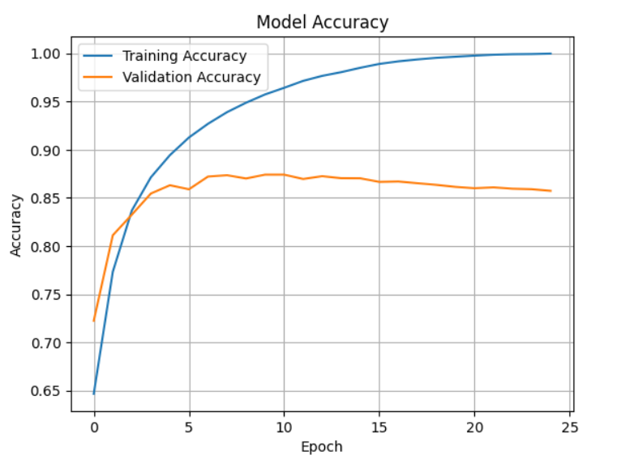
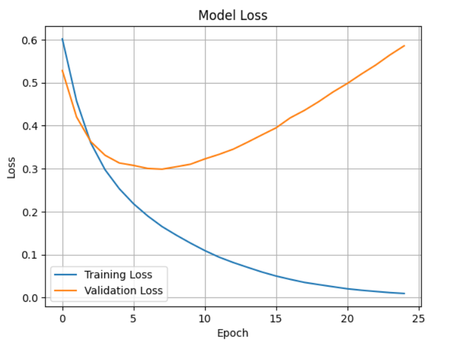

[](LICENSE) [](Python)
# Text Classification With TensorFlow

Text Classification with TensorFlow demonstrates binary sentiment analysis on IMDB movie reviews using TensorFlow and Keras. It covers data preprocessing, tokenization, model design, training, evaluation, and performance visualization.

---
## Table of Contents

- [Features](#features)  
- [Installation](#installation)  
- [Usage](#usage)  
- [Results](#results)  
- [Tech Stack](#tech-stack)  
- [Contributing](#contributing)  
- [Authors](#authors)  
- [License](#license)  
- [Acknowledgements](#acknowledgements)  
- [Support](#support)

---
## Features

- ✅ Binary sentiment classification (positive/negative) on IMDB reviews  
- ✅ End-to-end pipeline: loading, tokenization, modeling, training, evaluation  
- ✅ Lightweight Keras model with Embedding + GlobalAveragePooling  
- ✅ Saves training metrics (accuracy & loss) to CSV for easy plotting

---
## Installation

To run this project locally:

1. "Clone the repository"
```bash
    git clone https://github.com/your-username/text-classification-imdb  
    cd text-classification-imdb  
```
2. "Create a Conda Environment"
```bash
    conda env create -f environment.yml  
    conda activate tf_env  
```
3. "Launch Jupyter Notebook"
```bash
    jupyter notebook  
```

---
## Usage

- Open and run all cells in `notebooks/Text Classification.ipynb`.  
- The notebook trains a binary sentiment classifier on IMDB reviews.  
- To evaluate with the saved model:
  ```bash
  python src/evaluate.py --model-path models/sentiment_model.h5

---
## Results

### Model Accuracy


### Model Loss


---
## Tech Stack

- TensorFlow  
- TensorFlow Datasets  
- TensorFlow Hub  
- pandas  
- scikit-learn  
- Matplotlib

---
## API Reference

### `src/train.py`

| Flag           | Description                              | Default              |
| -------------- | ---------------------------------------- | -------------------- |
| `--epochs`     | Number of training epochs                | `5`                  |
| `--batch-size` | Batch size for training                   | `32`                 |
| `--model-path` | File path to save the trained model      | `models/sentiment_model.h5` |

### `src/evaluate.py`

| Flag           | Description                       | Default                         |
| -------------- | --------------------------------- | ------------------------------- |
| `--model-path` | Path to the saved Keras model     | `models/sentiment_model.h5`     |
| `--batch-size` | Batch size for evaluation         | `32`                            |

---
## Contributing

1. Fork the repo  
2. Create your feature branch (`git checkout -b feature/YourFeature`)  
3. Commit your changes (`git commit -m 'Add some feature'`)  
4. Push to the branch (`git push origin feature/YourFeature`)  
5. Open a Pull Request

---
## Authors

- **Sarthak Aloria** – [SarthakAloria](https://github.com/SarthakAloria)


---
## License

This project is licensed under the MIT License – see the [LICENSE](LICENSE) file for details.

---
## Acknowledgements

- The official [TensorFlow tutorial](https://www.tensorflow.org/tutorials/keras/text_classification)
- [IMDB dataset](https://www.tensorflow.org/datasets/catalog/imdb_reviews)

---
## Support

For any issues or feature requests, please open an issue on GitHub or contact me at sarthakaloria27@gmail.com.

---